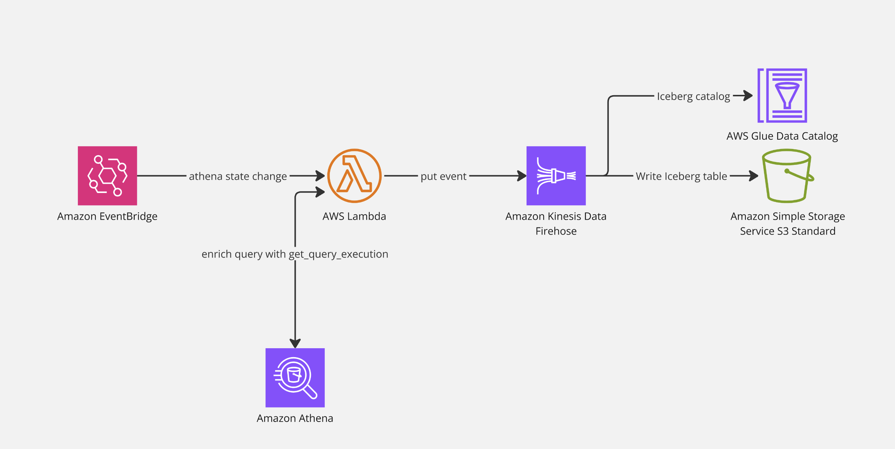

# terraform-aws-athena-query-observability
Terraform module that makes Athena query history querable via Iceberg tables


## Context
The main idea of this module is to make Athena query history querable via Iceberg tables.

## Requirements

- Terraform 1.8.0+
- Docker 24.0.0+

## Resources created by this module
- Lambda function to create the Iceberg table
- Lambda function to dispatch Event Bridge notifications to Firhose
- Firehose to send notifications to S3 as Iceberg table


### High level architecture




## Usage

```hcl
module "athena_query_observability_from_github" {
  source = "git::https://github.com/nicor88/terraform-aws-athena-query-observability?ref=v0.0.1"

  glue_database_name       = "athena_observability"
  glue_table_name          = "query_state_change_example"
  s3_bucket_table_location = "s3-data-bucket"
  s3_table_location_prefix = "athena_observability/query_state_change_example"

  firehose_s3_error_output_prefix = "athena_observability/query_state_change_example_errors"

  create_table_athena_workgroup_name        = "primary"
  create_table_athena_s3_output_bucket_name = "athena-query-results-bucket"
}
```

## Force table recreation
It might be necessary to force table recreation in some cases, for example when changing the table schema because of a change of the table schema of the module.

### Option 1: Use another table name
Use this settings:

```hcl
glue_table_name = "table_name_v2"
force_table_creation_trigger = "force"
```
In **glue_table_name** set a table name different than the previous one e.g. "table_name_v2". In **force_table_creation_trigger** 
put a value diffrent from the default value, that is an empty string.

### Option 2: Force table recreation and Firehose delivery stream recreation
```hcl
force_table_creation = "true"
force_table_creation_trigger = "force_recreating_table"
firehose_name_suffix = "-v2"

```

### Notes
When forcing table recreation, it can be that some events gets losts, therefore be careful when using any of the proposed options.

## Known issues
* It can happen that the module doesn't delete Cloudwatch logs, you might need to do it manually. Anyhow, this can be problematic if you remove the module and add it again.
* When forcing table recreation, it can happen that Firehose doesn't pick up the new table. The solution is to force recreation of the Firehose delivery stream by setting the `firehose_name_suffix` variable, or read the [force table recreation](#force-table-recreation) section.
